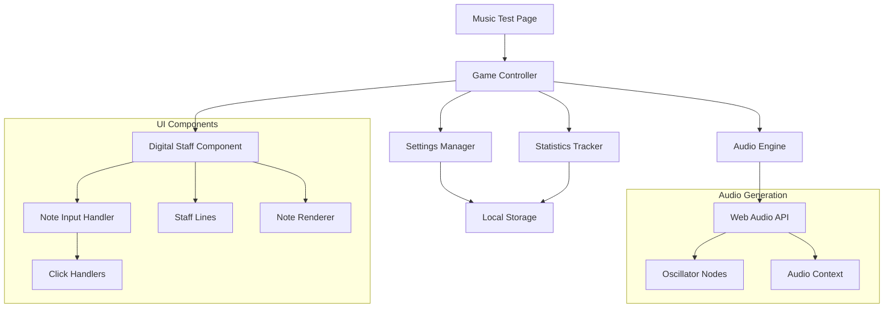

# Design Document

## Overview

The music note identification application will be built as a Next.js page within the existing boilerplate structure. The application uses Web Audio API for audio synthesis, React components for the digital staff interface, and local storage for user preferences and statistics tracking. The design follows a modular approach with separate components for audio generation, staff notation, and game logic.

## Architecture

The application follows a client-side architecture with the following key layers:

- **Presentation Layer**: React components for UI (staff, controls, feedback)
- **Business Logic Layer**: Game state management and note validation
- **Audio Layer**: Web Audio API integration for note synthesis
- **Data Layer**: Local storage for user preferences and statistics



## Components and Interfaces

### 1. Audio Engine (`AudioEngine.ts`)

Handles all audio-related functionality using Web Audio API.

```typescript
type AudioEngine = {
  playNotes: (frequencies: number[]) => Promise<void>;
  stopNotes: () => void;
  isSupported: () => boolean;
  setVolume: (volume: number) => void;
};

type NoteFrequencies = {
  [noteName: string]: number;
};
```

**Key Methods:**
- `generateNoteSet(count: number)`: Creates random set of notes
- `playSimultaneousNotes(notes: string[])`: Plays multiple notes in unison
- `getFrequency(noteName: string)`: Converts note names to frequencies

### 2. Digital Staff Component (`DigitalStaff.tsx`)

Interactive staff interface for note input and display.

```typescript
type DigitalStaffProps = {
  selectedNotes: string[];
  onNoteSelect: (note: string) => void;
  onNoteDeselect: (note: string) => void;
  maxNotes: number;
  showCorrectAnswer?: boolean;
  correctNotes?: string[];
};

type StaffPosition = {
  note: string;
  octave: number;
  yPosition: number;
};
```

**Features:**
- Treble clef staff with 5 lines
- Click-to-place note functionality
- Visual feedback for correct/incorrect notes
- Responsive design for mobile and desktop

### 3. Game Controller (`MusicTestController.tsx`)

Main component managing game state and orchestrating other components.

```typescript
type GameState = {
  currentNotes: string[];
  selectedNotes: string[];
  gamePhase: 'setup' | 'listening' | 'answering' | 'feedback';
  score: number;
  totalAttempts: number;
  difficulty: number;
};

type GameController = {
  startNewRound: () => void;
  submitAnswer: () => void;
  replayNotes: () => void;
  updateSettings: (settings: GameSettings) => void;
};
```

### 4. Settings Manager (`SettingsManager.ts`)

Handles user preferences and configuration.

```typescript
type GameSettings = {
  noteCount: number; // 2-6 notes
  volume: number; // 0-1
  autoReplay: boolean;
};

type SettingsManager = {
  loadSettings: () => GameSettings;
  saveSettings: (settings: GameSettings) => void;
  resetToDefaults: () => void;
};
```

### 5. Statistics Tracker (`StatisticsTracker.ts`)

Tracks user performance and progress.

```typescript
type UserStatistics = {
  totalAttempts: number;
  correctAnswers: number;
  accuracyByDifficulty: { [difficulty: number]: number };
  sessionHistory: SessionResult[];
};

type SessionResult = {
  timestamp: Date;
  difficulty: number;
  correct: boolean;
  notesPlayed: string[];
  userAnswer: string[];
};
```

## Data Models

### Note Representation

Notes are represented as strings in scientific pitch notation (e.g., "C4", "F#5").

```typescript
type NoteName = 'C' | 'C#' | 'D' | 'D#' | 'E' | 'F' | 'F#' | 'G' | 'G#' | 'A' | 'A#' | 'B';
type Octave = 3 | 4 | 5 | 6;
type Note = `${NoteName}${Octave}`;

const NOTE_FREQUENCIES: Record<Note, number> = {
  'C4': 261.63,
  'C#4': 277.18,
  'D4': 293.66,
  // ... complete mapping
};
```

### Staff Positions

Staff positions map notes to visual coordinates on the digital staff.

```typescript
type StaffPosition = {
  note: Note;
  linePosition: number; // 0-10 (lines and spaces)
  requiresLedgerLine: boolean;
  accidental?: 'sharp' | 'flat';
};
```

## Error Handling

### Audio Errors
- **Web Audio API not supported**: Display compatibility warning with fallback message
- **Audio context creation fails**: Show error message and disable audio features
- **Note playback fails**: Provide retry button and log error details

### User Input Errors
- **Invalid note selection**: Prevent selection and show visual feedback
- **Exceeding note limit**: Disable additional selections when limit reached
- **Network connectivity issues**: Cache game state locally and sync when available

### Data Persistence Errors
- **Local storage unavailable**: Fall back to session storage or in-memory storage
- **Settings corruption**: Reset to default settings with user notification
- **Statistics save failure**: Queue data for retry and notify user

## Testing Strategy

### Unit Tests
- **Audio Engine**: Mock Web Audio API and test note generation/playback
- **Digital Staff**: Test note selection/deselection logic and visual updates
- **Game Controller**: Test state transitions and game flow
- **Settings Manager**: Test persistence and validation of settings
- **Statistics Tracker**: Test accuracy calculations and data storage

### Integration Tests
- **Complete game flow**: Test full user journey from start to feedback
- **Audio-visual synchronization**: Verify notes play correctly when selected
- **Settings persistence**: Test settings save/load across sessions
- **Cross-browser compatibility**: Test Web Audio API support detection

### End-to-End Tests
- **User workflow**: Complete test session with note identification
- **Mobile responsiveness**: Touch interactions on digital staff
- **Performance testing**: Audio latency and UI responsiveness
- **Accessibility**: Screen reader compatibility and keyboard navigation

### Test Data
- **Predefined note sets**: Known combinations for consistent testing
- **Edge cases**: Maximum/minimum note counts, boundary conditions
- **Error scenarios**: Simulated audio failures and invalid inputs

## Performance Considerations

### Audio Performance
- **Preload audio context**: Initialize on user interaction to avoid delays
- **Efficient oscillator management**: Reuse oscillator nodes when possible
- **Audio buffer optimization**: Minimize latency between note triggers

### UI Performance
- **Virtual staff rendering**: Only render visible staff elements
- **Debounced interactions**: Prevent rapid-fire note selections
- **Lazy loading**: Load components only when needed

### Memory Management
- **Audio context cleanup**: Properly dispose of audio resources
- **Event listener cleanup**: Remove listeners on component unmount
- **Statistics data pruning**: Limit historical data storage size
